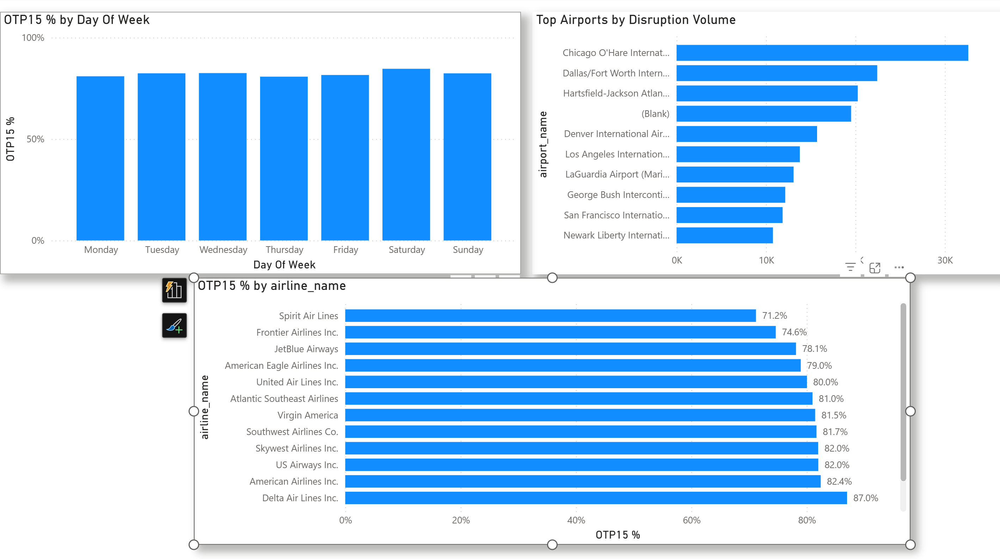
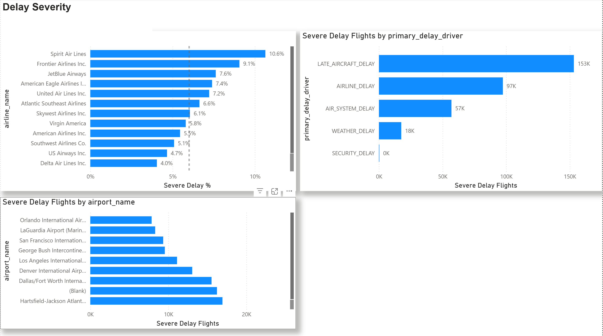

# Airline Operational Performance Analytics

**Portfolio project** | Operational Data Analyst case study

Dataset source: [Maven Analytics — Airline Flight Delays](https://mavenanalytics.io/data-playground/airline-flight-delays)

## Project Objective

This project analyses operational flight data to explore delay patterns, investigate root causes, and design a small reporting workflow from raw data through to a Power BI dashboard.  
The goal is to validate the dataset and define operational KPIs for reliable performance reporting.

## Dataset Overview

- **Primary dataset:** `data/raw/flights.csv` (~592 MB, ~5.8M flight records)
- **Supporting lookups:** `airlines.csv`, `airports.csv`, `cancellation_codes.csv`
- **Granularity:** one row per scheduled flight instance
- **Composite identity key:** `YEAR`, `MONTH`, `DAY`, `AIRLINE`, `FLIGHT_NUMBER`, `ORIGIN_AIRPORT`, `DESTINATION_AIRPORT`, `SCHEDULED_DEPARTURE`

## Project Structure

| Step | Notebook                                                   | Purpose                           |
| ---- | ---------------------------------------------------------- | --------------------------------- |
| 1    | `01 — Load_profile.ipynb`                                  | Data validation and profiling     |
| 2    | `02 — Curated Operational Dataset + KPI Foundations.ipynb` | Star schema model and KPI flags   |
| 3    | Power BI                                                   | Operational performance dashboard |

## Step 1: Data Quality Validation

Controlled loading and validation checks:

- Explicit dtype control via `DTYPE_MAP` (`Int8`/`Int16`/`Int32` + `category`)
- Standardised result recording via `DQ_RESULTS` and `add_dq_result()`
- Checks for identity integrity, cancellation consistency, delay sanity, and time-delay coherence
- Issue sampling into `issues_samples.csv`

## Key Findings

- **Duplicate identity check:** 0 duplicates using the composite key
- **Cancellation integrity:** `CANCELLED` aligns with `CANCELLATION_REASON` (0 inconsistencies)
- **Null pattern behaviour:** operationally consistent across schedule/actual fields
- **Extreme delays:** rare but operationally plausible; flagged for transparency
- **Nuance:** some cancelled flights have `DEPARTURE_TIME` populated but no `ARRIVAL_TIME`
- **Time vs delay consistency:** mismatch rate of 0.0151%, concentrated in extreme multi-day delay scenarios

## Step 2: Curated Analytical Model

Star schema design for Power BI:

- **Fact table:** `fact_flights.parquet`
- **Dimensions:** `dim_airlines.csv`, `dim_airports.csv`, `dim_cancellation_codes.csv`

### KPI Framework

| KPI                           | Definition                                 |
| ----------------------------- | ------------------------------------------ |
| On-Time Performance (OTP15) % | `ARRIVAL_DELAY <= 15` for eligible flights |
| Severe Delay %                | `ARRIVAL_DELAY >= 60` for eligible flights |
| Cancellation Rate             | `CANCELLED = 1` / all flights              |
| Operational Disruption %      | Cancelled, diverted, or severely delayed   |

**Eligibility:** `CANCELLED = 0` AND `DIVERTED = 0`

### Derived Features

- `is_otp15_eligible`, `is_on_time_otp15`, `is_delayed_otp15`, `is_severe_delay_sd60`
- `primary_delay_driver`, `operational_disruption_flag`
- Time slicing: `scheduled_departure_hour`, `time_band`, `day_of_week`, `month`

## Step 3: Power BI Dashboard

Operational performance dashboard with four pages:

1. **Executive Overview** — high-level KPIs and trends
2. **Operational Analysis** — airline/route performance breakdowns
3. **Delay Severity** — severity distribution and Primary Delay Driver attribution
4. **Key Insights** — summary of key findings

## Dashboard Overview

### Executive Overview

### Operational Analysis

### Delay Severity

## Key Insights

Based on the Power BI analysis:

- **Overall On-Time Performance (OTP15): 82.1%**  
  Roughly **1 in 5 flights arrive more than 15 minutes late**, indicating delays remain a regular operational issue across the network.

- **Operational Disruption Rate: 7.4%**  
  This includes cancelled, diverted, and severely delayed flights. While smaller than overall delay rates, these events represent the most operationally disruptive cases.

- **Severe Delays Are Concentrated in Certain Airlines**  
  Severe delay exposure varies significantly across airlines.  
  For example, **Spirit Airlines (10.6%)** and **Frontier Airlines (9.1%)** show higher severe delay rates compared with the network average.

- **Late Aircraft Delay Is the Dominant Root Cause**  
  The majority of severe delays are attributed to **Late Aircraft Delay**, suggesting that delays often propagate through aircraft rotations rather than being caused by external factors.

- **Major Hub Airports Generate the Largest Disruption Volumes**  
  Airports such as **Chicago O'Hare, Dallas/Fort Worth, and Hartsfield-Jackson Atlanta** account for the highest volumes of disruption events. These hubs handle large traffic volumes, increasing the likelihood of congestion and delay propagation.

- **Seasonal Variation in Performance**  
  On-time performance dips during peak summer months and improves in early autumn, which likely reflects higher travel demand and operational pressure during peak periods.

## Data Quality Outputs

| File                                | Description                                                                     |
| ----------------------------------- | ------------------------------------------------------------------------------- |
| `data/processed/dq_summary.csv`     | Validation log with check name, severity, rows checked, failed count, and notes |
| `data/processed/issues_samples.csv` | Sampled investigation records labelled by `issue_type`                          |

## How to Run

1. Open the project in VS Code
2. Activate your Python environment
3. Run `Notebooks/01 — Load_profile.ipynb` (Restart Kernel and Run All)
4. Run `Notebooks/02 — Curated Operational Dataset + KPI Foundations.ipynb`
5. Confirm outputs in `data/processed/`
6. Open `Powerbi/` dashboard for visualisation

## Design Rationale

The project validates record identity, cancellation fields, delay ranges, and time–delay consistency before building dashboards.  
This ensures that the Power BI analysis focuses on operational performance rather than underlying data quality issues.

## Limitations

Some limitations to note:

- **Airport identifier inconsistencies:**  
  ~~The raw dataset contains both IATA airport codes and numeric identifiers. Numeric codes were retained but do not have full descriptive metadata.~~  
  **Update:** This has been partially resolved. A DOT airport lookup was used to create deterministic DOT → IATA mappings using canonical airport name + state matching. 215 of 307 airports were successfully mapped; 92 remain unmatched due to alias naming differences and are documented in `unmatched_dot_airports.csv`. Numeric identifiers were reduced from ~486k to ~141k occurrences in the fact table.

- **Aircraft rotation information is not available:**  
  Delay propagation through aircraft rotations can be observed indirectly but cannot be fully modelled without aircraft scheduling data.

- **Dashboard visual styling is intentionally simple:**  
  The Power BI report prioritises analytical clarity over visual design. Layout and formatting improvements are still in progress.

- **Operational scope:**  
  The dataset represents historical flight records and does not include real-time operational data such as weather forecasts, staffing levels, or airspace constraints.

## What I Would Improve

This project focuses on building a clean analytical baseline rather than a fully polished dashboard.

If I continued working on it, I would mainly focus on:

- improving the visual layout and spacing in Power BI
- adding more drilldowns (for example route-level or time-of-day analysis)
- investigating the `(Blank)` airport category more thoroughly
- adding a small data dictionary for the engineered fields
- tightening the insight section so each chart clearly answers one question

The goal of those improvements would be to make the report easier to interpret and closer to something used in day-to-day operational reporting.

## Tools Used

- Python
- pandas
- Jupyter Notebook
- Power BI
- Parquet
- Dimensional modelling (star schema)
