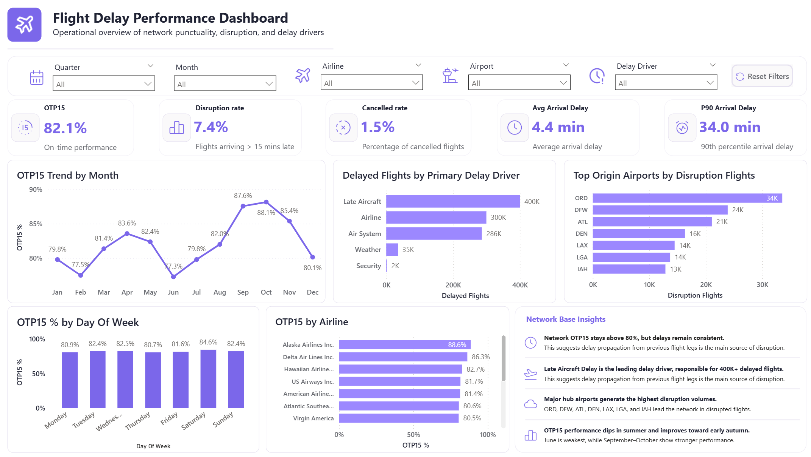

# Airline Operational Performance Analytics

**Portfolio project** | Data pipeline, analytics engineering, and operational reporting case study

Dataset source: [Maven Analytics - Airline Flight Delays](https://mavenanalytics.io/data-playground/airline-flight-delays)

## Project Objective

This project takes raw airline operations data through a small analytics workflow: validation, cleaning, modelling, KPI definition, SQL-based checks, and an early Power BI reporting page.

The goal is to show how messy operational data can be turned into trustworthy, documented datasets that support both downstream analysis and business reporting.

## Engineering and Analytics Focus

This project is intentionally framed as both a data engineering and data analyst portfolio piece:

- **Data engineering focus:** controlled loading, data quality checks, reference-data cleanup, reproducible transformations, parquet outputs, and dimensional modelling.
- **Analytics focus:** operational KPI design, SQL-based metric validation, Power BI reporting, and clear interpretation of delay and disruption patterns. The SQL layer is now started and will likely continue to expand as more analysis questions are added.

## Dataset Overview

- **Primary dataset:** `Data/Raw/flights.csv` (~592 MB, ~5.8M flight records, not tracked in Git)
- **Supporting lookups:** `airlines.csv`, `airports.csv`, `cancellation_codes.csv`
- **Granularity:** one row per scheduled flight instance
- **Composite identity key:** `YEAR`, `MONTH`, `DAY`, `AIRLINE`, `FLIGHT_NUMBER`, `ORIGIN_AIRPORT`, `DESTINATION_AIRPORT`, `SCHEDULED_DEPARTURE`

## Project Structure

| Step | Notebook | Purpose |
| ---- | -------- | ------- |
| 1 | `01 - Load_profile.ipynb` | Load control, data profiling, and quality validation |
| 2 | `02 - Curated Operational Dataset + KPI Foundations.ipynb` | Curated model, KPI flags, reference cleanup, and star schema outputs |
| 3 | `SQL Analytical Layer.ipynb` | Initial DuckDB/SQL layer for KPI validation and airline performance analysis |
| 4 | Power BI | Example dashboard page and reporting roadmap |

## Pipeline Summary

### Step 1: Data Quality Validation

Controlled loading and validation checks:

- Explicit dtype control via `DTYPE_MAP` (`Int8`/`Int16`/`Int32` + `category`)
- Standardised result recording via `DQ_RESULTS` and `add_dq_result()`
- Identity integrity checks using the composite flight key
- Cancellation consistency checks across `CANCELLED` and `CANCELLATION_REASON`
- Delay sanity checks and time-delay coherence checks
- Issue sampling into `issues_samples.csv` for reviewable data quality evidence

### Step 2: Curated Analytical Model

Star schema design for Power BI and downstream analysis:

- **Fact table:** `fact_flights.parquet` (generated output, not tracked)
- **Dimensions:** `dim_airlines`, `dim_airports`, `dim_cancellation_codes`, `dim_delay_driver`
- **Quality outputs:** `dq_summary.csv`, `issues_samples.csv`, `unmatched_dot_airports.csv`

### Step 3: SQL Analytical Layer

`SQL Analytical Layer.ipynb` now adds a DuckDB-based SQL layer over the curated fact and dimension tables. The current version focuses on verifying core KPIs directly from the model and producing an airline performance scorecard.

Current SQL coverage:

- schema inspection for the curated fact table and dimensions
- fleet-level KPI checks for OTP15, average arrival delay, severe delay rate, cancellation rate, and operational disruption rate
- direct SQL validation of KPI flags created in the modelling step
- airline-level performance comparison across volume, punctuality, delay severity, cancellation, and disruption metrics

The SQL layer is intentionally still open-ended. More queries are likely to be added for route analysis, airport-level disruption, delay-driver breakdowns, and time-based trends.

## Measures and KPI Definitions

These measures are defined to keep the curated model and dashboard reporting consistent.

| Measure | Definition | Purpose |
| ------- | ---------- | ------- |
| Total Flights | Count of scheduled flight records | Baseline operational volume |
| Completed Flights | Flights where `CANCELLED = 0` and `DIVERTED = 0` | Eligible base for delay performance |
| On-Time Performance (OTP15) % | Completed flights with `ARRIVAL_DELAY <= 15` divided by completed flights | Standard punctuality measure |
| Delay Rate (OTP15) % | Completed flights with `ARRIVAL_DELAY > 15` divided by completed flights | Share of flights arriving more than 15 minutes late |
| Severe Delay % | Completed flights with `ARRIVAL_DELAY >= 60` divided by completed flights | High-impact delay exposure |
| Cancellation Rate | Flights with `CANCELLED = 1` divided by total scheduled flights | Cancellation reliability measure |
| Operational Disruption % | Flights cancelled, diverted, or severely delayed divided by total scheduled flights | Combined disruption indicator |

**Eligibility rule:** on-time, delay, and severe-delay measures only use completed flights (`CANCELLED = 0` and `DIVERTED = 0`).

## Power BI Dashboard Status

The Power BI report is still a work in progress. The current public showcase is the redesigned **Executive Overview** page, which is intended to show the overall structure and reporting direction rather than a finished multi-page dashboard.

### Current Showcase: Executive Overview

The Executive Overview page currently includes:

- headline KPI cards for the main operational measures, including total flight volume, on-time performance, severe delays, cancellations, and overall disruption
- a high-level view of operational performance so the reader can quickly understand the scale and reliability of the network
- supporting visuals for comparing performance across key operational dimensions such as airline, airport, time, and delay behaviour
- a layout that is designed as the starting point for a fuller Power BI report, with the remaining pages still to be built out

### Dashboard Roadmap

The remaining report pages are intentionally left as future improvements:

- **Operational Analysis:** airline, airport, route, and time-of-day performance breakdowns
- **Delay Severity:** severity bands, severe-delay concentration, and delay-driver attribution
- **Key Insights:** final narrative page tying the dashboard findings together

## Key Findings So Far

Based on the curated model and initial dashboard analysis:

- **Overall On-Time Performance (OTP15): 82.1%**  
  Roughly 1 in 5 completed flights arrive more than 15 minutes late.

- **Operational Disruption Rate: 7.4%**  
  Cancelled, diverted, and severely delayed flights are a smaller share of total activity but represent the most operationally disruptive cases.

- **Severe Delays Are Concentrated in Certain Airlines**  
  Severe delay exposure varies significantly across airlines, with some carriers showing materially higher severe-delay rates than the network average.

- **Late Aircraft Delay Is the Dominant Root Cause**  
  Severe delays are strongly associated with late-arriving aircraft, suggesting that delay propagation through aircraft rotations is a major operational factor.

- **Major Hub Airports Generate the Largest Disruption Volumes**  
  High-volume hub airports account for the largest absolute disruption counts, reflecting congestion and network-scale operational pressure.

## Data Quality Findings

- **Duplicate identity check:** 0 duplicates using the composite key
- **Cancellation integrity:** `CANCELLED` aligns with `CANCELLATION_REASON` (0 inconsistencies)
- **Null pattern behaviour:** operationally consistent across scheduled and actual flight fields
- **Extreme delays:** rare but operationally plausible, flagged for transparency rather than removed
- **Time vs delay consistency:** mismatch rate of 0.0151%, concentrated in extreme multi-day delay scenarios
- **Airport identifier cleanup:** DOT numeric airport identifiers were partially mapped to IATA codes using deterministic name and state matching

## Data Quality Outputs

| File | Description |
| ---- | ----------- |
| `Data/Processed/dq_summary.csv` | Validation log with check name, severity, rows checked, failed count, and notes |
| `Data/Processed/issues_samples.csv` | Sample investigation records labelled by issue type |
| `Data/Processed/unmatched_dot_airports.csv` | Remaining airport identifiers requiring manual/alias review |

## Repository Notes

Large generated datasets are intentionally excluded from Git. The repository focuses on notebooks, documentation, small reference outputs, and dashboard screenshots.

The raw `flights.csv` file and generated fact table are not tracked because of file size.

## How to Run

1. Open the project in VS Code or Jupyter.
2. Activate a Python environment with `pandas`, `numpy`, and `pyarrow`.
3. Add the raw Maven dataset to `Data/Raw/`.
4. Run `Notebooks/01 - Load_profile.ipynb`.
5. Run `Notebooks/02 - Curated Operational Dataset + KPI Foundations.ipynb`.
6. Run or review `Notebooks/SQL Analytical Layer.ipynb` for SQL-based KPI checks and the airline performance scorecard.
7. Open the Power BI file to view the dashboard draft.

## Limitations

- The dashboard is not complete; only the redesigned Executive Overview page is currently showcased.
- The SQL analytical layer is an initial version; it validates core KPIs and airline performance, but does not yet cover every planned route, airport, delay-driver, or time-trend question.
- The dataset is historical and does not include live operational feeds, weather forecasts, staffing data, or aircraft rotation schedules.
- Some airport identifiers remain unmatched after deterministic mapping because of naming and alias differences.
- Delay propagation can be inferred but not fully modelled without aircraft tail-number or rotation data.

## Future Improvements

- Expand the SQL analytical layer with route-level, airport-level, delay-driver, and time-trend queries.
- Complete the Operational Analysis dashboard page.
- Complete the Delay Severity dashboard page.
- Add a final Key Insights dashboard page.
- Add a compact data dictionary for engineered fields.
- Add automated validation tests outside the notebooks.
- Package the transformation logic into reusable Python scripts.

## Tools Used

- Python
- pandas
- SQL
- Jupyter Notebook
- Power BI
- Parquet
- Dimensional modelling

